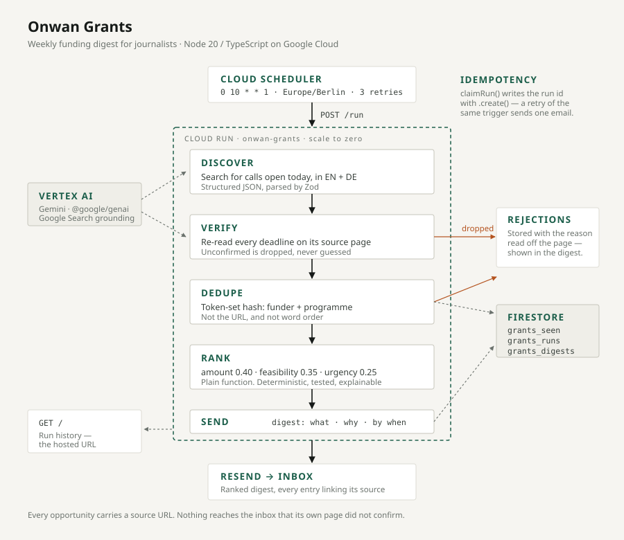

# Onwan Grants · منح عنوان

An agent that hunts funding for journalists while nobody is watching. Once a week it
finds open calls, checks they are real, rules out what you cannot apply for, and emails
what is left.

**Live:** <https://onwan-grants-xivuqbajca-ew.a.run.app> — the hosted run history.

---

## The problem

Grants, fellowships, and residencies for journalists are scattered across dozens of
aggregators and organisation sites. Deadlines are buried in prose. Most listings turn out
to exclude you anyway — on region, career stage, or language — and you only discover that
after reading the fine print. It recurs every few weeks, it is tedious, and things get
missed.

## How it runs



<details>
<summary>Same thing as text</summary>

```
Cloud Scheduler  (Mondays 10:00 Europe/Berlin)
      │
      ▼
Cloud Run — onwan-grants  (Node 20 / TypeScript)
      │
      ├─ DISCOVER   Gemini via Vertex AI with Google Search grounding
      │               → open calls returned as structured JSON, parsed by Zod
      │
      ├─ VERIFY     re-check every deadline against its own source page
      │               → anything unconfirmed is dropped, not guessed
      │
      ├─ DEDUPE     Firestore token-set hash on organisation + programme
      │               → same call, renamed between runs, still counts once
      │
      ├─ RANK       deterministic score on amount · feasibility · urgency
      │               → rejects stored with the reason they failed
      │
      └─ SEND       Resend → digest email: what, why, by when
      │               → seven at most, capped before anything is marked sent
      │
      └─ GET /      minimal page of past digests — the hosted URL
```

</details>

### Three decisions worth defending

**Verify is not optional.** A model asked to list grant deadlines will invent some. A
journalist who misses a real call because this agent reported a fabricated date is worse
off than if it had never been built. Every field carries a `sourceUrl`, and every deadline
is re-read from that page before it ships. On the first live run, verify rejected all six
discovered opportunities — each with a checkable reason read off the source page
("applications are currently paused, next call opens 1 December"). Without that stage, six
dead ends would have arrived looking like live ones.

**One rejection per run is healthy, not a bug.** A run where verify drops nothing means
verify has stopped working.

**The digest states only what it can source.** Every call gets the same brief — the page's
own deadline, a field table, what the programme is, and the required paperwork as a
checklist you can tick off. The three best are weighted for the eye (a gold rule, a warm
banner, a tinted header) and they alone carry the application steps, which are the longest
block on a card and would bury the top three if repeated seven times.

What is deliberately absent is suggested angles, a drafted pitch, or any "your unique
advantage is" paragraph. Funders increasingly require AI-use disclosure on the application
itself, and a digest that mixed sourced facts with generated advice would force the reader
to sort one from the other — which is precisely what the verify stage exists to spare them.
The email signs off by handing the work back: *"Now, your turn to make a genuine
application!"*

**Seven calls at most, and the cap is applied before anything is remembered.** A longer
list is one nobody finishes. The slice happens in the pipeline rather than the renderer for
a specific reason: `remember()` marks what was sent, so capping at render time would mark
calls sent that no email ever carried, and dedupe would then hide them forever. What does
not make the cut stays unseen and is eligible next week — the run log prints
`sending 7 of 8 fresh` so the queue is visible.

The scoring internals are not shown. The order they produce is useful; three sub-scores
printed beside every entry made the email read like a debug dump. The score appears once
per call as a whole number out of ten — a decimal implies a precision the weights do not
have.

**Ranking is a plain function, not a model call** (`src/agent/rank.ts`). It is
deterministic, so the same input gives the same digest; it is unit-tested; and it is
explainable, so every entry in the email carries its own score breakdown and the reader
can disagree with the ranking rather than having to trust it.

## Idempotency

Cloud Scheduler retries on a slow response. Without a guard, a retry means the digest
arrives twice.

The run id is derived from the trigger, not minted per request: a Scheduler delivery uses
`sched-<X-CloudScheduler-ScheduleTime>`, which is identical across every retry of the same
trigger. `claimRun` then writes that id to Firestore with `.create()`, which fails if the
document exists — an atomic claim with no transaction needed. The loser exits with
`status: "duplicate"` before doing any work.

Prove it against the live service:

```bash
KEY=$(gcloud secrets versions access latest --secret=ONWAN_GRANTS_RUN_KEY)
URL=https://onwan-grants-xivuqbajca-ew.a.run.app

curl -X POST -H "Content-Type: application/json" \
     -H "X-Onwan-Run-Key: $KEY" -H "X-Onwan-Run-Id: demo-01" -d '{}' $URL/run
# → {"status":"sent", ...}

curl -X POST -H "Content-Type: application/json" \
     -H "X-Onwan-Run-Key: $KEY" -H "X-Onwan-Run-Id: demo-01" -d '{}' $URL/run
# → {"status":"duplicate", ...}   one email, not two
```

`X-Onwan-Run-Id` is namespaced under `manual-` internally, so replaying one can never
claim — and so suppress — the id a scheduled trigger is about to use. A malformed id is a
`400`, never a silent fallback to a random one.

> Ordering note: opportunities are marked seen **after** a successful send
> (`src/pipeline/run.ts`). Marking them first would mean a failed send silently loses those
> calls forever.

## HTTP surface

| Route | Auth | Purpose |
|---|---|---|
| `GET /` | none | Run history — the hosted URL for the submission |
| `GET /status` | none | Liveness. Not `/healthz`: the Google Front End intercepts that path on Cloud Run |
| `POST /run` | `X-Onwan-Run-Key` | Trigger a run. Cloud Scheduler, or by hand |

`POST /run` requires a body — the Google Front End rejects a POST with no `Content-Length`
with a `411` before it reaches the container.

## Running it locally

```bash
npm ci
cp .env.example .env      # fill in RUN_KEY, RESEND_API_KEY, DIGEST_TO
gcloud auth application-default login   # Vertex AI + Firestore credentials
npm run dev
```

There is no API key in this repository. Vertex AI and Firestore both authenticate through
application-default credentials locally and the Cloud Run service account in production.

```bash
npm test        # 11 tests, the ranking function
npm run check   # typecheck, no emit
npm run build   # tsc → dist/
```

## Configuration

Read once at module load and split into two tiers (`src/config.ts`). `config` holds what
the process needs merely to *start* — if any of it is missing the container still boots,
because a container that crash-loops on Cloud Run gives you no logs to debug with.
`requireRunConfig()` holds what a run needs, and throws with the missing names, because a
run that quietly skips sending is worse than one that fails loudly.

| Variable | Default | Notes |
|---|---|---|
| `GOOGLE_CLOUD_PROJECT` | `onwan-production` | |
| `VERTEX_LOCATION` | `global` | |
| `GEMINI_MODEL` | `gemini-3.6-flash` | |
| `PORT` | `8080` | Injected by Cloud Run |
| `RUN_KEY` | — | Shared secret for `POST /run`. Secret Manager |
| `RESEND_API_KEY` | — | Secret Manager |
| `DIGEST_FROM` | `onboarding@resend.dev` | No domain verification needed |
| `DIGEST_TO` | — | Recipient |

Firestore collections are namespaced `grants_seen`, `grants_runs`, `grants_digests` so this
service can share a project with the existing Onwan backend without any chance of touching
its data.

## Deploying

```bash
gcloud run deploy onwan-grants --source . --region=europe-west1
```

Env vars and mounted secrets are preserved across an in-place update. The weekly trigger:

```bash
gcloud scheduler jobs create http onwan-grants-weekly \
  --location=europe-west1 \
  --schedule="0 10 * * 1" --time-zone="Europe/Berlin" \
  --uri="https://onwan-grants-xivuqbajca-ew.a.run.app/run" \
  --http-method=POST --message-body='{}' \
  --attempt-deadline=900s --max-retry-attempts=3 \
  --min-backoff=60s --max-backoff=600s
gcloud scheduler jobs update http onwan-grants-weekly --location=europe-west1 \
  --update-headers="X-Onwan-Run-Key=$(gcloud secrets versions access latest --secret=ONWAN_GRANTS_RUN_KEY)"
```

`attempt-deadline` matches the Cloud Run request timeout exactly — setting it higher would
be a lie, since Cloud Run kills the request at 900s regardless.

## Cost

Effectively just Gemini calls. Cloud Run scales to zero between runs; Cloud Scheduler and
Firestore stay inside their free tiers.

## Scope

Deliberately absent, and not by accident: no Google OAuth consent screen or verification
(there is no user data), no Gmail API (mail goes through Resend, avoiding a sensitive scope
entirely), no domain (Cloud Run issues a free HTTPS `.run.app` URL), no signup or
multi-user support, no privacy policy or terms — a single user, no data collected. The
service is deployed and unlisted, never marketed.

*Onwan* is the pre-existing platform this sits beside. Nothing is copied from it, including
the config loaders and clients that would have been quick to lift.

## Licence

AGPL-3.0-only.
